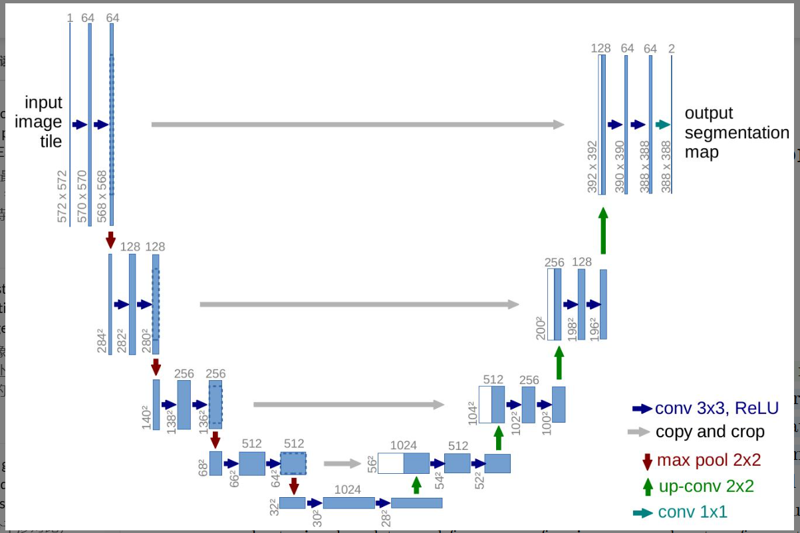

# 论文阅读笔记

## 1. 基本信息

- **标题**: U-Net: Convolutional Networks for Biomedical Image Segmentation
- **作者**: Olaf Ronneberger, Philipp Fischer, Thomas Brox
- **年份 / 会议**: 2015 / MICCAI (Medical Image Computing and Computer Assisted Intervention)
- **关键词**: U-Net, 图像分割 (Image Segmentation), 生物医学影像, 深度学习, 全卷积网络 (FCN)

### 一句话总结
这篇论文主要解决了**生物医学领域标注样本极少且需要像素级精确分割**的问题，提出了**一种对称的 U 型全卷积网络架构（U-Net）**，最终实现了**在极少样本下依然能获得高精度分割，并赢得了多项国际细胞追踪挑战赛冠军**的效果。

---

## 2. 研究背景与问题

### 背景
在生物医学图像处理中，任务通常不是简单的图像分类（判别图里是什么），而是**定位（Localization）**，即需要对图像中的每个像素分配类别标签。

### 现有方法的问题
1.  **标注数据匮乏**：医学图像的标注需要专家知识，很难获得像 ImageNet 那样百万级的标注数据集。
2.  **滑动窗口（Sliding-window）效率低下**：此前的主流方法是取像素周围的 Patch 进行分类，这导致大量重复计算，速度极慢。
3.  **上下文与定位的权衡**：大的窗口能看到更多上下文（Context）但降低了定位精度，小的窗口则相反。

### 论文要解决的问题
作者试图设计一种能够**从极少量数据中学习**、能够**同时兼顾上下文信息和精准定位**、且**推理速度极快**的端到端网络。

---

## 3. 核心方法

### 核心思想
U-Net 的核心在于 **“收缩”与“扩张”的对称平衡** ：通过收缩路径捕获图像的抽象语义（上下文），通过扩张路径将这些语义投影回原始分辨率，并利用“跳跃连接”（Skip Connections）将浅层的精细纹理补充给深层，实现精确还原。

### 方法流程

**输入图像**  
↓  
**收缩路径 (Contracting Path)**：重复 3x3 卷积 + ReLU + 2x2 最大池化，逐渐降低分辨率并增加通道数（捕获“是什么”）。  
↓  
**瓶颈层 (Bottleneck)**：最深层的特征表示。  
↓  
**扩张路径 (Expansive Path)**：重复上采样（Up-conv）+ 拼接收缩路径的特征图 + 3x3 卷积（恢复“在哪里”）。  
↓  
**1x1 卷积输出**：将多通道特征图映射为所需的类别数。  
↓  
**像素级分割图**

### 与已有方法的区别
相比于传统的 FCN（全卷积网络），U-Net 的**扩张路径（Decoder）更加厚实**（通道数多），并且引入了 **剪裁与拼接（Crop and Concatenate）** 机制，让上采样过程能够直接利用来自收缩路径的高分辨率特征，而不是仅仅依赖粗糙的深层上采样。

---

## 4. 实验

### 实验环境
- **数据集 / Workload**: ISBI 2012 神经元结构分割、ISBI 2015 细胞追踪挑战赛 (PhC-U373, DIC-HeLa)。
- **硬件 / 模拟器**: NVidia Titan GPU (6 GB)。
- **Baseline**: Sliding-window CNN (Ciresan et al.) 以及其他挑战赛参赛模型。
- **主要指标**: Warping Error (扭曲误差), Rand Error, Pixel Error, IOU (交并比)。

### 主要实验结果

| 实验 | 比较内容 | 结果 | 说明 |
|---|---|---|---|
| EM Segmentation | U-Net vs. Ciresan et al. | **0.000353** (Warping Error) | 远优于当时最强的滑动窗口法 (0.000420)。 |
| PhC-U373 数据集 | IOU 评分 | **0.9203** | 远超第二名 (0.83)。 |
| DIC-HeLa 数据集 | IOU 评分 | **0.7756** | 远超第二名 (0.46)，领先幅度巨大。 |

### 最重要的图

**Figure 1: U-net architecture** (Page 2)

**这张图说明**：展示了网络经典的“U”型结构。左侧是下采样（Encoder），右侧是上采样（Decoder），中间贯穿着灰色的水平箭头，代表特征拼接。

**理解**：这不仅是一个美学上的对称，更是一个逻辑上的闭环。左边在“丢弃”空间信息以换取语义，右边在“利用”左边的空间信息来“还原”语义。

---

## 5. 论文贡献

主要有：

1.  **架构创新**：提出了全对称的 Encoder-Decoder 结构和 Skip Connection 机制，成为后来医学影像分割的标配。
2.  **弹性变形数据增强 (Elastic Deformations)**：证明了在医学图像中，通过模拟细胞/组织的弹性形变，可以极大地缓解样本不足的问题。
3.  **重叠切片策略 (Overlap-tile strategy)**：解决了在显存有限的情况下，如何对任意大尺寸的图像进行无缝分割。

**其中最重要的是**：**Skip Connection（跳跃连接）的设计。**

**原因**：它解决了深度卷积神经网络中“语义”与“细节”不可兼得的矛盾，通过拼接操作保留了不同尺度的信息流。

---

## 6. ⭐ 思考

### 做得好的地方
- **简洁性**：U-Net 没有复杂的注意力机制或残差连接（当时还没流行），仅靠结构对称就达到了巅峰性能。
- **针对性强**：深刻理解医学图像的特点（形变多、样本少、边界模糊），针对性地设计了 Loss Weight Map（加权损失函数）来强制学习细胞间的缝隙。

### 存在的问题
- **Padding 缺失**：原论文使用 Unpadded 卷积，导致输出图像比输入小，这在多层嵌套或处理特定尺寸时会带来计算上的麻烦（现代实现多采用 Same Padding）。

### 我没看懂 / 有疑问的地方
- **Overlap-tile 在边界镜像时的伪影处理**：虽然文中提到用镜像填充，但在极极端边界处，这种策略是否会影响拓扑结构的准确性？

### 为什么这个方法有效?
从原理上讲，卷积操作具有平移不变性，但丢失了位置信息。U-Net 的有效性在于它构建了一个**多尺度信息融合机制**。高层特征提供“全局视野”，低层特征提供“局部细节”，两者通过 Concatenate 融合，使得网络在决定每一个像素的类别时，既知道它属于哪个大的组织，也知道它精确的边缘线在哪里。

### 如果改进
1.  **引入 Residual Connection**：在 U-Net 的每个 Block 中加入残差连接，加快训练收敛。
2.  **引入 Attention Gate**：在跳跃连接处增加注意力机制（Attention U-Net），过滤掉收缩路径中与分割目标无关的背景噪声。
---

## 7. 总结

### 这篇论文解决了什么?
- 解决了小样本下的高精度像素级语义分割问题。

### 怎么解决的?
- 设计了对称的 U 型架构，通过跳跃连接融合深浅层特征，并配合强力的数据增强和加权损失函数。

### 效果怎么样?
- 在多个医学影像挑战赛中获得第一，且推理速度极快（512x512 图像 < 1s）。

### 对我有什么启发?
- **结构的力量**：有时候一个优雅的结构设计比复杂的调参更有效。
- **理解数据**：针对特定领域（如医学）的特性设计数据增强和损失函数（如处理接触物体间的缝隙）是成功的关键。

### 是否值得复现?
**是**。

**原因**：U-Net 是图像分割领域的“Hello World”，它是所有现代分割模型（DeepLab, Mask R-CNN 等）的重要思想来源，也是进入医学影像 AI 领域的必经之路。